---
## Front matter
title: "Лабораторная работа №2"
subtitle: "Операционные системы"
author: "Спиридонова Алина Артёмовна"

## Generic otions
lang: ru-RU
toc-title: "Содержание"

## Bibliography
bibliography: bib/cite.bib
csl: pandoc/csl/gost-r-7-0-5-2008-numeric.csl

## Pdf output format
toc: true # Table of contents
toc-depth: 2
lof: true # List of figures
lot: true # List of tables
fontsize: 12pt
linestretch: 1.5
papersize: a4
documentclass: scrreprt
## I18n polyglossia
polyglossia-lang:
  name: russian
  options:
	- spelling=modern
	- babelshorthands=true
polyglossia-otherlangs:
  name: english
## I18n babel
babel-lang: russian
babel-otherlangs: english
## Fonts
mainfont: PT Serif
romanfont: PT Serif
sansfont: PT Sans
monofont: PT Mono
mainfontoptions: Ligatures=TeX
romanfontoptions: Ligatures=TeX
sansfontoptions: Ligatures=TeX,Scale=MatchLowercase
monofontoptions: Scale=MatchLowercase,Scale=0.9
## Biblatex
biblatex: true
biblio-style: "gost-numeric"
biblatexoptions:
  - parentracker=true
  - backend=biber
  - hyperref=auto
  - language=auto
  - autolang=other*
  - citestyle=gost-numeric
## Pandoc-crossref LaTeX customization
figureTitle: "Рис."
tableTitle: "Таблица"
listingTitle: "Листинг"
lofTitle: "Список иллюстраций"
lotTitle: "Список таблиц"
lolTitle: "Листинги"
## Misc options
indent: true
header-includes:
  - \usepackage{indentfirst}
  - \usepackage{float} # keep figures where there are in the text
  - \floatplacement{figure}{H} # keep figures where there are in the text
---

# Цель работы

 Изучить идеологию и применение средств контроля версий.
 Освоить умения по работе с git.

# Задание

    Создать базовую конфигурацию для работы с git.
    Создать ключ SSH.
    Создать ключ PGP.
    Настроить подписи git.
    Зарегистрироваться на Github.
    Создать локальный каталог для выполнения заданий по предмету.

# Теоретическое введение

# Выполнение лабораторной работы

Описываются проведённые действия, в качестве иллюстрации даётся ссылка на иллюстрацию (рис. @fig:001).

{#fig:001 width=70%}
1. Зададим имя и email владельца репозитория:
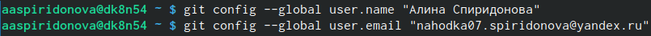{#fig:002 width=90%}
2. Настроим utf-8 в выводе сообщений git:
{#fig:003 width=90%}
3. Зададим имя начальной ветки (будем называть её master):
{#fig:004 width=90%}
4. Параметр autocrlf:
{#fig:005 width=90%}
5. Параметр safecrlf:
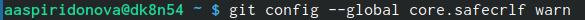{#fig:006 width=90%}
6. Создадим ключи ssh по алгоритму rsa с ключём размером 4096 бит:
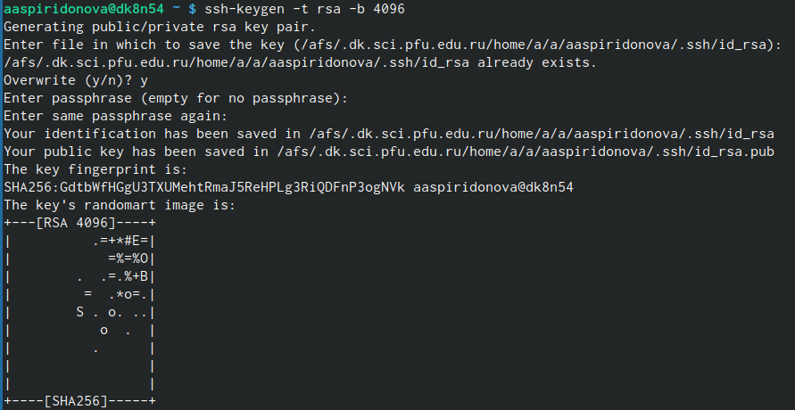{#fig:007 width=90%}
по алгоритму ed25519:
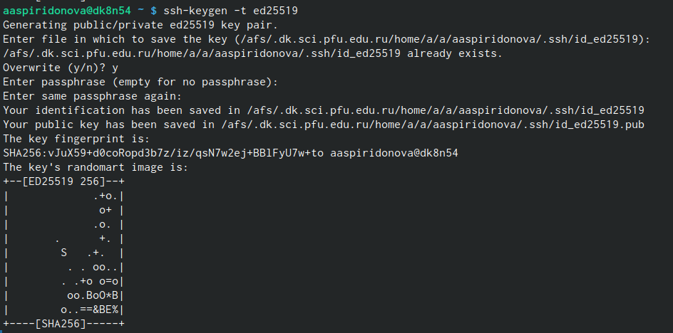{#fig:008 width=90%}
7. Генерируем ключ gpg
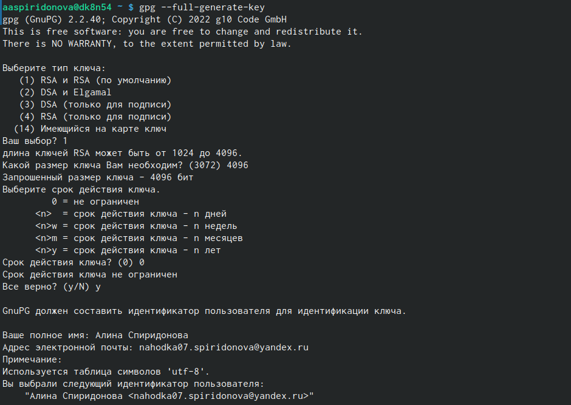{#fig:009 width=90%}
8. Выводим список ключей и копируем отпечаток приватного ключа:
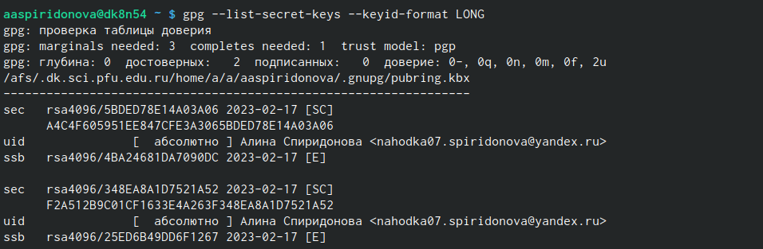{#fig:010 width=90%}
9. Cкопируйте ваш сгенерированный PGP ключ в буфер обмена:
{#fig:011 width=90%}
10. Используя введёный email, укажите Git применять его при подписи коммитов:
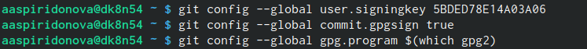{#fig:012 width=90%}
11. Авторизация github.
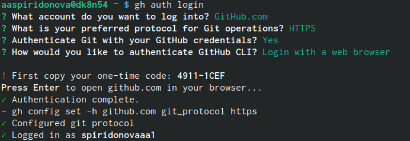{#fig:013 width=90%}
12. Создаём репозиторий
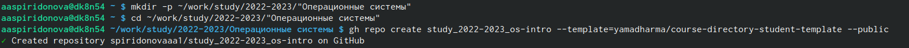{#fig:014 width=90%}
13. Настраиеваем каталог курса и отправляем файлы на сервер.
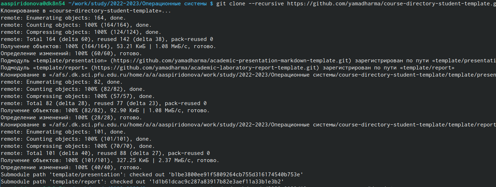{#fig:015 width=90%}
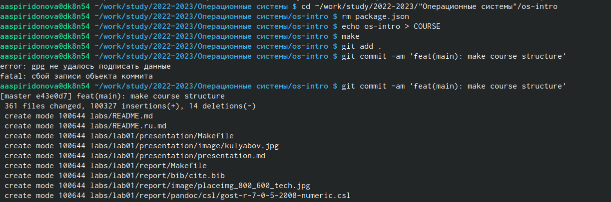{#fig:016 width=90%}

# Выводы
В ходе выполнения лабораторной работы мне удалось изучить идеологию и применение средств контроля версий,а также освоить умения по работе с git.

# Список литературы{.unnumbered}

::: {#refs}
:::
